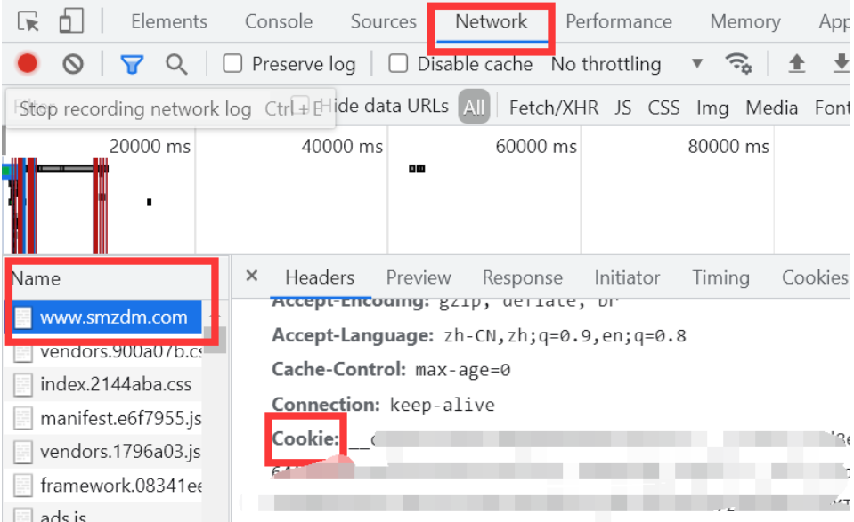

# SMZDM-Auto-Check-in
什么值得买自动签到工具

## 使用

1. fork到自己仓库

2. 去什么值得买的[官网](https://www.smzdm.com/)登录以后，按F12进入调试模式，点击上方Network，刷新，在左侧Name一栏找到www.smzdm.com，找到Cookie，全部复制下来

   

3. 在自己的fork仓库中，点击Settings-Secrets，点New repository secret，Name填Cookie，Value填刚才复制下来的值，然后点Add secret就完成了

4. 接下来只要等每天八点自动签到即可

2022/05/15尝试开始使用
